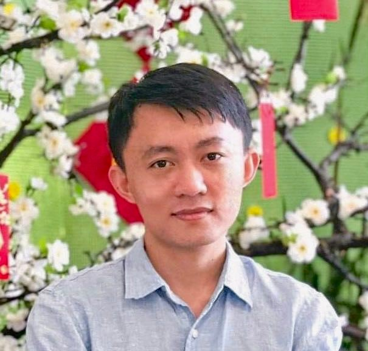
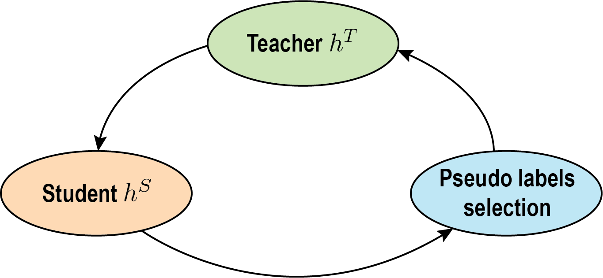
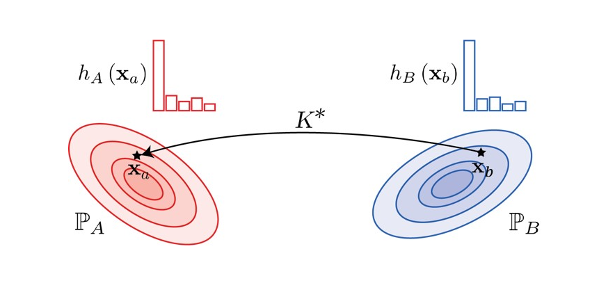
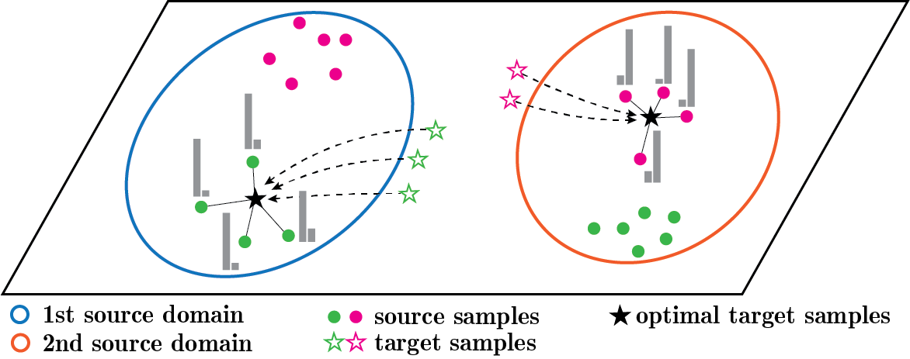
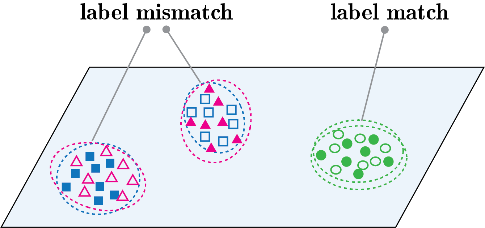
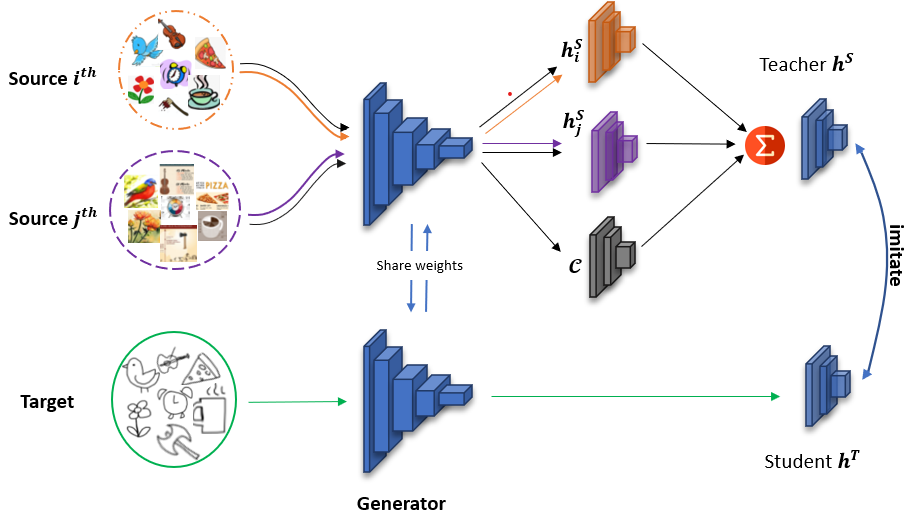
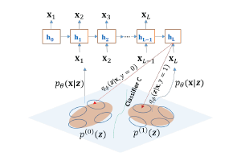
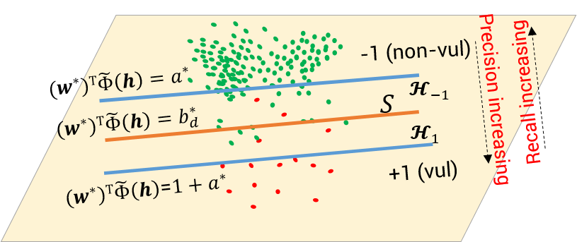
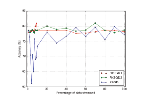

## About Me

Hi, I'm Tuan Nguyen, and I have earned a PhD in machine learning, deep learning, and computer vision. My doctoral studies were completed at Monash University, under the expert guidance of [Prof. Dinh Phung](https://research.monash.edu/en/persons/dinh-phung), [Dr. Trung Le](https://research.monash.edu/en/persons/trung-le), and [Dr. He Zhao](https://hezgit.github.io/).

## Research Interest

My academic pursuits encompass the fields of machine learning and deep learning, with a keen emphasis on:

- Domain Adaptation,
- Generative Artificial Intelligence,
- Transfer Learning and Learning with Limited Labels,
- Kernel Methods,
- Optimal Transport techniques.

The core objective of my PhD project is to harness the comprehensive and methodical framework provided by optimal transport theory to address the challenge of learning in environments with limited labels. This represents a significant, pivotal, and intricate issue that facilitates the training of models with minimally labeled data. My ambition is to merge the advancement of theoretical principles within deep learning with their application to real-world societal issues.

A quote that continually inspires me:

<i>"It Always Seems Impossible Until It Is Done."</i> - Nelson Mandela

## Hobbies

I have a strong passion for sports, including badminton, soccer, and table tennis. Additionally, playing the guitar and indulging in books are among my favored pastimes.

## Contact

I look forward to engaging in stimulating discussions and potential collaborations with you. Please feel free to contact me through:

- [Email](mailto:[name]@monash.edu where [name]=tuan.ng)
- [Linkedin](https://www.linkedin.com/in/tuanrpt)
- [Twitter](https://twitter.com/tuanrpt)

## Publications

<table class="tg">
<tbody>
  <tr>
    <td class="tg-0lax td-img"></td>
    <td class="tg-0lax">
        <strong><a style="text-decoration:none; color:blue">Cycle Class Consistency with Distributional Optimal Transport and Knowledge Distillation for Unsupervised Domain Adaptation</a></strong>
        
<b>Tuan Nguyen</b>, Van Nguyen, Trung Le, He Zhao, Quan Hung Tran, and Dinh Phung.

        
UAI, 2022.

        
<a href="https://openreview.net/pdf?id=ScUndLLjceq">[Paper]</a>

    </td>
  </tr>
  <tr>
    <td class="tg-0lax td-img"></td>
    <td class="tg-0lax">
        <strong><a style="text-decoration:none; color:blue">TIDOT: A Teacher Imitation Learning Approach for Domain Adaptation with Optimal Transport</a></strong>
        
<b>Tuan Nguyen</b>, Trung Le, Nhan Dam, Quan Hung Tran, Truyen Nguyen, and Dinh Phung.

        
IJCAI, 2021.

        
<a href="https://www.ijcai.org/proceedings/2021/0394.pdf">[Paper]</a>

    </td>
  </tr>
  <tr>
    <td class="tg-0lax td-img"></td>
    <td class="tg-0lax">
        <strong><a style="text-decoration:none; color:blue">MOST: Multi-Source Domain Adaptation via Optimal Transport for Student-Teacher Learning</a></strong>
	    
<b>Tuan Nguyen</b>, Trung Le, He Zhao, Quan Hung Tran, Truyen Nguyen, and Dinh Phung.

        
UAI, 2021.

        
<a href="https://proceedings.mlr.press/v161/nguyen21a/nguyen21a.pdf">[Paper]</a><a href="https://github.com/tuanrpt/MOST">[Code]</a><a href="src/MOST/UAI_MOST_slides.pdf">[Slides]</a>

	</td>
  </tr>
  <tr>
    <td class="tg-0lax td-img"></td>
    <td class="tg-0lax">
        <strong><a style="text-decoration:none; color:blue">LAMDA: Label Matching Deep Domain Adaptation</a></strong>
        
Trung Le, <b>Tuan Nguyen</b>, Nhat Ho, Hung Bui, and Dinh Phung.

        
ICML, 2021.

        
<a href="http://proceedings.mlr.press/v139/le21a/le21a.pdf">[Paper]</a><a href="https://github.com/tuanrpt/LAMDA">[Code]</a>

    </td>
  </tr>
  <tr>
    <td class="tg-0lax td-img"></td>
    <td class="tg-0lax">
        <strong><a style="text-decoration:none; color:blue">STEM: An approach to Multi-source Domain Adaptation with Guarantees</a></strong>
        
Van-Anh Nguyen, <b>Tuan Nguyen</b>, Trung Le, Quan Hung Tran, and Dinh Phung.

        
ICCV, 2021.

        
<a href="https://openaccess.thecvf.com/content/ICCV2021/papers/Nguyen_STEM_An_Approach_to_Multi-Source_Domain_Adaptation_With_Guarantees_ICCV_2021_paper.pdf">[Paper]</a><a href="https://github.com/byM1902/STEM_iccv21_8566">[Code]</a>

    </td>
  </tr>
  <tr>
​   <td class="tg-0lax td-img"></td>
	<td class="tg-0lax">
        <strong><a style="text-decoration:none; color:blue">Maximal divergence sequential autoencoder for binary software vulnerability detection</a></strong>
        
Tue Le, <b>Tuan Nguyen</b>, Trung Le, Dinh Phung, Paul Montague, Olivier De Vel and Lizhen Qu.

        
ICLR, 2018.

        
<a href="https://openreview.net/pdf?id=ByloIiCqYQ">[Paper]</a><a href="https://github.com/dascimal-org/MDSeqVAE">[Code]</a>

	</td>
  </tr>
  <tr>
​   <td class="tg-0lax td-img"></td>
	<td class="tg-0lax">
        <strong><a style="text-decoration:none; color:blue">Deep cost-sensitive kernel machine for binary software vulnerability detection</a></strong>
        
<b>Tuan Nguyen</b>, Trung Le, Khanh Nguyen, Olivier de Vel, Paul Montague, John Grundy, and Dinh Phung.

        
PAKDD, 2020.

        
<a href="https://link.springer.com/chapter/10.1007/978-3-030-47436-2_13">[Paper]</a><a href="https://github.com/tuanrpt/DCKM">[Code]</a><a href="src/DCKM/dckm_slides.pdf">[Slides]</a>

	</td>
  </tr>
  <tr>
​   <td class="tg-0lax td-img"></td>
	<td class="tg-0lax">
        <strong><a style="text-decoration:none; color:blue">Fuzzy Kernel Stochastic Gradient Descent Machines</a></strong>
        
<b>Tuan Nguyen</b>, Phuong Duong, Trung Le, Anh Le, Viet Ngo, Dat Tran and Wanli Ma.

        
IJCNN, 2016.

        
<a href="https://ieeexplore.ieee.org/document/7727611">[Paper]</a>

	</td>
  </tr>
</tbody>
</table>

## News 
January 2024: I have received my conferral letter and completed my PhD program.

August 2023: I am thrilled to have received a Research Assistant position at Monash University.

May 2022: Our paper "Cycle Class Consistency with Distributional Optimal Transport and Knowledge Distillation for Unsupervised Domain Adaptation" has been accepted to UAI 2022.

July 2021: Our paper "STEM: An approach to Multi-source Domain Adaptation with Guarantees" has been accepted to ICCV 2021.

May 2021: Our paper "LAMDA: Label Matching Deep Domain Adaptation" has been accepted to ICML 2021.

May 2021: Our paper "MOST: Multi-Source Domain Adaptation via Optimal Transport for Student-Teacher Learning" has been accepted to UAI 2021.

April 2021: Our paper "TIDOT: A Teacher Imitation Learning Approach for Domain Adaptation with Optimal Transport" has been accepted to IJCAI 2021.

March 2021: I have advanced to a Ph.D. degree due to my notable research achievements.

March 2020: I commenced my Master's degree at Monash University, Australia, under the supervision of Prof. Dinh Phung, Dr. Trung Le, and Dr. He Zhao.

## Professional Services

I am honored to serve as a reviewer for prestigious conferences such as AAAI, AISTATS, ICCV, CVPR, ICML, and NeurIPS.

## Teaching
2023: Teaching Associate - Head Tutor, [FIT5215 Deep learning, Semester 2](https://handbook.monash.edu/2023/units/FIT5215), Monash University.

2022: Teaching Associate - Head Tutor, [FIT5215 Deep learning, Semester 2](https://handbook.monash.edu/2022/units/FIT5215), Monash University.

2022: Teaching Associate, [FIT3181 Deep learning, Semester 2](https://handbook.monash.edu/2022/units/FIT3181), Monash University.

2021: Teaching Associate - Head Tutor, [FIT5215 Deep learning, Summer Semester A](https://handbook.monash.edu/2021/units/FIT5215), Monash University.

2021: Teaching Associate, [FIT5215 Deep learning, Semester 2](https://handbook.monash.edu/2021/units/FIT5215), Monash University.

